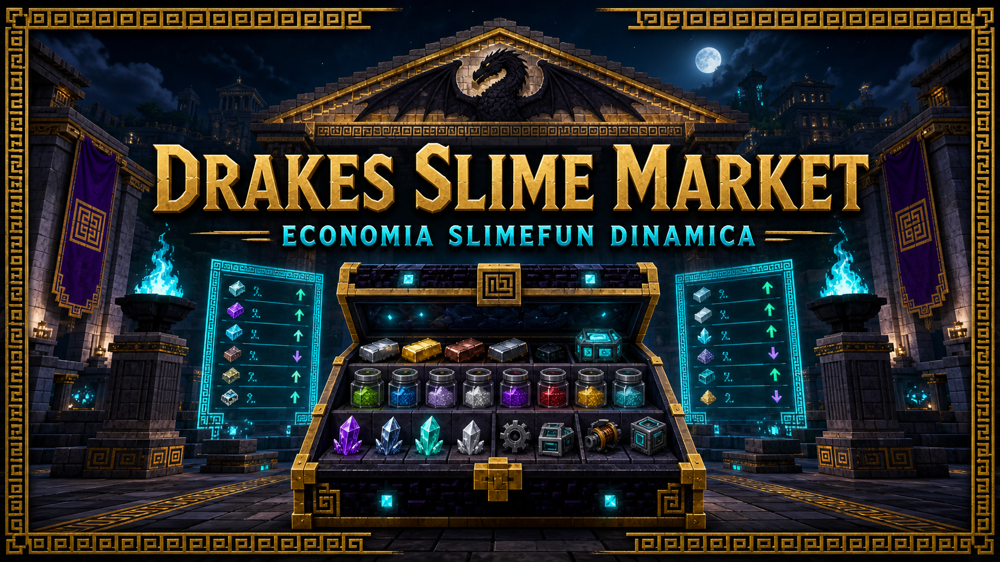

<p align="center">
  
</p>

# DrakesSlimeMarket

Mercado dinamico de materiales Slimefun para **DrakesCraft**. Descubre el catalogo
real de Slimefun y de los addons cargados, filtra familias peligrosas y publica una
ventana de precios nueva cada 30 minutos usando demanda, Vault y depositos de
**sBank**.

> El jugador entra desde la seccion Slimefun del unico `/tienda`. `/sfmercado` es
> el comando interno y administrativo del modulo, no una tienda paralela.

## Experiencia de compra

| Accion | Resultado |
| --- | --- |
| Click | Compra una unidad al precio vigente. |
| Shift + click | Compra un stack completo segun el maximo real del item. |
| Flechas | Recorren todo el catalogo paginado sin compartir estado entre jugadores. |
| Reloj central | Muestra ofertas, circulacion observada, sBank y hora de la ventana. |

La entrega es atomica: primero valida espacio y saldo, conserva un snapshot del
inventario, cobra mediante Vault y entrega una copia del item registrado por
Slimefun. Si aparece cualquier sobrante inesperado, restaura el inventario y
reembolsa el cobro. Nunca arroja compras al suelo.

## Catalogo real

El plugin consulta `Slimefun.getRegistry().getEnabledSlimefunItems()` despues del
arranque. Esto incorpora automaticamente materiales de todos los addons instalados
sin mantener una lista de IDs copiada a mano. Cada refresco deja en consola el total
aceptado y el desglose por addon.

La admision es conservadora:

- Familias de material: polvo, lingote, nugget, placa, aleacion, mena, gema,
  esencia, fragmento, cristal, fibra, goma, plastico y otros insumos configurados.
- Bloqueo duro por addon para InfinityExpansion y Supreme.
- Bloqueo duro de cheat, armas, herramientas, armaduras, maquinas, generadores,
  reactores, almacenamientos, mochilas, spawners y talismanes.
- Una entrada manual puede incorporar un material excepcional, pero nunca evita
  las denegaciones de seguridad.

```yaml
catalog:
  entries:
    MATERIAL_EXCEPCIONAL:
      enabled: true
      base-price: 1250.0
    MATERIAL_RETIRADO:
      enabled: false
```

## Precio dinamico

Cada ventana combina cuatro senales acotadas:

1. Precio base por familia. Los polvos parten en `25`, los lingotes en `180` y los
   materiales de mayor elaboracion escalan desde ahi.
2. Dinero en wallets Vault de jugadores conectados.
3. Depositos de todas las cuentas de sBank mediante una integracion opcional de
   solo lectura.
4. Demanda del item durante la ventana y una oscilacion determinista maxima de 3%.

El multiplicador final queda entre `0.85x` y `1.85x`. La referencia de circulacion
es `100.000.000`, pensada para la economia real de DrakesCraft, donde existen
cuentas de decenas o cientos de millones. Todos los limites viven en `config.yml`.

## Auditoria

Cada compra confirmada se registra de forma asincrona en:

```text
plugins/DrakesSlimeMarket/audit/purchases.csv
```

El registro incluye fecha, UUID, jugador, ID Slimefun, addon, cantidad, precio
unitario, total y saldo posterior. La cola se vacia cada diez segundos y al apagar
el plugin.

## Comandos

| Comando | Permiso | Uso |
| --- | --- | --- |
| `/sfmercado` | `drakesslimemarket.use` | Abre el mercado. |
| `/sfmercado stats` | `drakesslimemarket.admin` | Resume catalogo y circulacion. |
| `/sfmercado reload` | `drakesslimemarket.admin` | Recarga reglas, catalogo y precios. |

## Integraciones

- **Slimefun:** fuente canonica de IDs e ItemStacks.
- **Vault:** cobro, saldo y formato monetario.
- **sBank:** lectura opcional de depositos para medir circulacion.
- **Odysseia:** punto de entrada desde `/tienda`; no se reemplaza su menu general.

El Market no modifica Slimefun, sBank ni Odysseia. Los puentes viven dentro de este
plugin y fallan de forma cerrada si una integracion opcional cambia.

## Desarrollo

Requiere Java 21 y Paper/Purpur 1.21.11.

```powershell
mvn clean verify
```

Las pruebas cubren limites de precios, estabilidad de ventanas, denegacion de
Infinity/Supreme y rechazo de maquinas/equipo incluso cuando alguien intenta
aprobarlos manualmente.

<p align="center">
  
</p>
